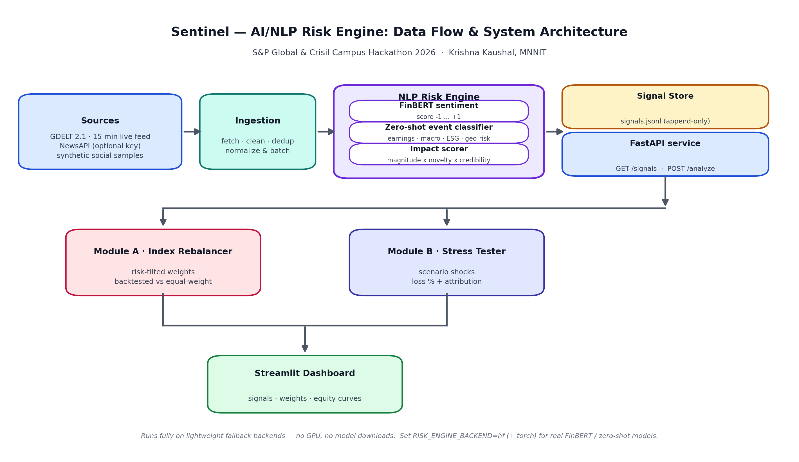

# Sentinel — AI/NLP Risk Engine · S&P Global & Crisil Campus Hackathon 2026

**Candidate Name:** Krishna Kaushal · **College:** MNNIT · **Demo Video Link:** [UNLISTED YOUTUBE LINK — to be recorded per [docs/demo_script.md](docs/demo_script.md)] · Slide deck: [docs/presentation.pdf](docs/presentation.pdf)

---

## 1. Project Overview

**Sentinel** is a real-time AI/NLP risk engine that turns the firehose of financial news and social chatter into structured, actionable risk signals. It ingests headlines from GDELT's 15-minute global feed, NewsAPI, and bundled synthetic social samples, then runs every item through a three-stage NLP pipeline: (1) FinBERT-style sentiment scoring (−1 … +1), (2) zero-shot event classification (earnings, macro, ESG, geopolitical risk, …), and (3) an impact scorer that weighs magnitude × novelty × source credibility. Each signal carries the affected entities/tickers so it can drive portfolio decisions directly.

Those signals are persisted to an append-only signal store (`data/signals.jsonl`) and served over a FastAPI layer (`GET /signals`, `POST /analyze`), feeding **two downstream risk modules**: **Module A**, an index rebalancer that tilts portfolio weights away from names under negative risk pressure and backtests the tilt against an equal-weight baseline; and **Module B**, a portfolio stress tester that applies event-driven scenario shocks to a wholesale portfolio and attributes the resulting loss by position and risk factor. Everything is explorable in an interactive Streamlit dashboard.

The whole pipeline runs on commodity hardware with **zero model downloads**: lightweight fallback backends (VADER-style lexicon sentiment, heuristic event classification) stand in for FinBERT and zero-shot classifiers, with a single environment flag (`RISK_ENGINE_BACKEND=hf`) switching to real Hugging Face models when `torch` is installed. No API keys are required for the default path — GDELT is keyless and every external dependency degrades gracefully to bundled or synthetic data.

## 2. Architecture & Tech Stack



**Data flow:** Sources (GDELT 2.1 15-min feed · NewsAPI · synthetic social samples) → **Ingestion** (fetch, clean, dedup, normalize) → **NLP Risk Engine** (FinBERT sentiment · zero-shot event classifier · impact scorer) → **Signal Store** (`data/signals.jsonl`) + **FastAPI** (`/signals`, `/analyze`) → **Module A** (index rebalancer) and **Module B** (stress tester) → **Streamlit dashboard** (signals · weights · equity curves).

| Layer | Technology | Why |
|---|---|---|
| Ingestion | `requests`, `python-dateutil`, GDELT 2.1 API, NewsAPI (optional) | Keyless live news; stdlib-grade HTTP with graceful fallback |
| NLP | `transformers` (optional), `vaderSentiment` (fallback), `numpy` | FinBERT/zero-shot when available; lexicon fallback keeps demo GPU-free |
| Signal serving | `fastapi`, `uvicorn` | Typed JSON API for signals and ad-hoc text analysis |
| Modules A & B | `pandas`, `numpy`, `yfinance` | Vectorised backtests; real price history with synthetic fallback |
| Dashboard | `streamlit`, `plotly`, `matplotlib` | Interactive weights, equity curves, stress attribution |
| Docs & deck | `python-pptx`, `matplotlib` (Agg) | Deck generated from real run metrics — see `docs/build_deck.py` |

## 3. Dataset Used

- **GDELT 2.1 (live, no key)** — the 15-minute global news feed is the primary real-time source. If it is unreachable, the pipeline falls back to cached/bundled samples and logs the degradation instead of crashing.
- **NewsAPI (optional key)** — used only when `NEWSAPI_KEY` is set; silently skipped otherwise (graceful fallback, never a hard dependency).
- **Bundled synthetic samples (clearly labeled)** — social-media-style posts shipped with the repo for offline and demo runs (`--sources synthetic_social`). Every synthetic record is tagged `"synthetic": true`.
- **Prices via yfinance (with synthetic fallback)** — daily OHLC history for the watchlist; if the network is unavailable, a deterministic synthetic price generator keeps the backtests reproducible.
- **Synthetic wholesale portfolio (clearly labeled)** — Module B runs on a fabricated book of positions; no real client, fund, or personal data anywhere in the repo.

**Assumptions:** headlines are English; entity→ticker mapping covers a fixed watchlist of large-cap names; free-tier feeds may lag by minutes; synthetic data is representative of headline *structure*, not of market outcomes; backtests ignore transaction costs and slippage (noted as a limitation in the deck).

## 4. Quickstart & Installation

Runtime: **Python 3.10+**.

```bash
git clone <repo-url>          # TODO: replace with the public repo URL
cd crisil-hackathon
pip install -r requirements.txt

# 1. Run the risk engine on synthetic social samples (writes data/signals.jsonl)
PYTHONPATH=src python -m risk_engine.pipeline --sources synthetic_social --limit 40

# 2. Module A — backtest the risk-tilted index rebalance
PYTHONPATH=src python -m module_a.backtest

# 3. Module B — run the portfolio stress test
PYTHONPATH=src python -m module_b.stress_test

# 4. API — signal store + ad-hoc analysis
PYTHONPATH=src uvicorn api.main:app --port 8000

# 5. Dashboard — signals, weights, equity curves, stress attribution
PYTHONPATH=src streamlit run src/dashboard/app.py
```

To use the real Hugging Face backends instead of the lightweight fallbacks: `pip install torch --index-url https://download.pytorch.org/whl/cpu` and `export RISK_ENGINE_BACKEND=hf` (see `requirements.txt`).

## 5. Key Results & Domain Impact

Running the pipeline end-to-end produces:

- **`data/signals.jsonl`** — one JSON object per ingested item: raw text, source, timestamp, sentiment score (−1 … +1), predicted event type with confidence, impact score, and linked tickers. This is the contract every downstream module consumes.
- **`data/module_a_results.json`** — Module A backtest metrics: cumulative return and Sharpe ratio of the risk-tilted rebalance vs. the equal-weight baseline, plus turnover and max drawdown. The dashboard renders both equity curves side by side so the value of the risk tilt is visible at a glance.
- **`data/module_b_results.json`** — Module B stress-test output: portfolio loss % under each event-driven scenario, the worst-case scenario, and per-position / per-factor loss attribution. The dashboard shows before/after portfolio value and an attribution bar chart.

**Domain impact for risk desks:** Sentinel compresses the news-to-action loop from hours to minutes. Instead of analysts skimming headlines, a risk manager gets an intraday, ticker-linked risk feed that (a) systematically de-risks index exposure ahead of negative event clusters and (b) quantifies "what breaks, and by how much" before the shock lands — the two questions every risk committee asks. Because the engine runs keyless and offline-capable, it can sit on a desk laptop or a free-tier cloud box with no data-vendor contract.

### AI usage & integrity

This project was built with AI assistance (Muse) — code, docs, and demo assets were drafted with an AI coding agent and reviewed by the candidate. All work is original to this hackathon submission. **No confidential, proprietary, or client data was used**: inputs are public feeds (GDELT, NewsAPI), public market data (yfinance), or synthetic data explicitly labeled as such.

---

*Docs: [Architecture diagram](docs/architecture.png) · [Demo script](docs/demo_script.md) · [Slide deck](docs/presentation.pdf) · Deck generator: `docs/build_deck.py`*
